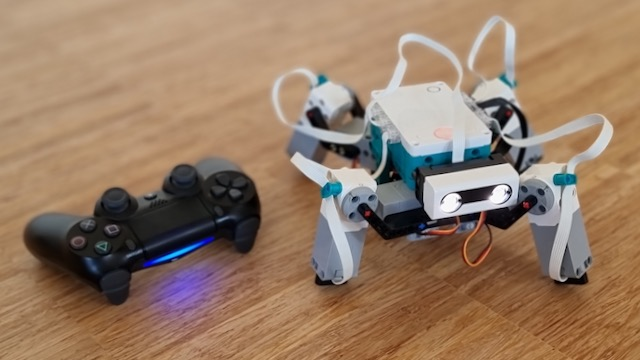
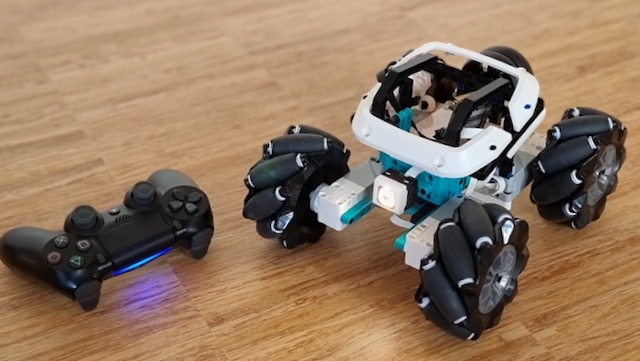

# ESP-IDF + Arduino + Bluepad32 + Uartremote + LEGO Mindstorms

This is an ESP32 firmware that connects to most Bluetooth classic gamepads, based on Bluepad32. You can then call the esp32 over UART from your MINDSTORMS hub to get the gamepad state. We developed this firware specifically for the [LMS-ESP32 board](https://antonsmindstorms.com/product/wifi-python-esp32-board-for-mindstorms/), although it should run on most ESP32 devices.

We have successfully tested it with PS4 and Ninentendo Switch controllers. PS3 will work too, but it is really hard to connect.

# Projects
## MINDSTORMS Spider
- [MINDSTORMS code](https://github.com/antonvh/mpy-robot-tools/blob/master/Example%20projects/bluepad_servo_spider.py) is in the mpy-robot-tools repo
- [Building instructions on Patreon](https://www.patreon.com/posts/62344422)



## MINDSTORMS Mecanum wheel car
- [MINDSTORMS code](https://github.com/antonvh/mpy-robot-tools/blob/master/Example%20projects/bluepad_mecanum_wheels.py) is in the mpy-robot-tools repo
- [Building instructions on Patreon](https://www.patreon.com/posts/60769850)



# Setup
## Flashing the build on an ESP32 device.
Install esptool. I use pipenv, so I go `pipenv install esptool`. But for most people pip will be fine:
``` sh
pip install esptool
```

Then enter the command below. It will autodetect the ESP32 if one is connected. If you have multiple boards connected, add `-p /dev/cu.usbserial-143220` (Mac) or `-p /dev/ttyAMA0` (Linux)

``` sh
esptool.py -b 460800 --before default_reset --after hard_reset --chip esp32 write_flash --flash_mode dio --flash_freq 40m --flash_size detect 0x10000 build/app-template.bin 0x1000 build/bootloader/bootloader.bin 0x8000 build/partition_table/partition-table.bin
```
## Connecting the gamepad
Once the LMS-ESP32 is powered on, it will pair with any gamepads it sees. Just put the gamepad in pairing mode. Most gamepads have a dedicated button for this. On the PS4 controller you need to hold the PS and SHARE buttons for a few seconds. The light on the controller turns blue once connected.

# Background info

This project is based on the bluepad template project 3.0.0 (Feb 28, 2022). If you want to update to update to a newer bluepad version, you need to clone the template again and copy these files over the template:
- components/Adafruit_NeoPixel
- components/UartRemote
- components/arduinoFFT
- components/ESP32Servo
- main/arduino_main.cpp
- main/CMakeLists.txt


This is an application to be used with [Espressif IoT Development Framework](https://github.com/espressif/esp-idf).

Please check [ESP-IDF docs](https://docs.espressif.com/projects/esp-idf/en/latest/get-started/index.html) for getting started instructions.

Requires ESP-IDF **v4.4** or newer.

Includes the following ESP-IDF components, with a pre-configured `sdkconfig` file:

* [Arduino Core for ESP32](https://github.com/espressif/arduino-esp32) component
* [Bluepad32](https://gitlab.com/ricardoquesada/bluepad32/) component
* [BTStack](https://github.com/bluekitchen/btstack) component

## How to compile it

### For Windows

1. Install [ESP-IDF v4.4][esp-idf-windows-installer]. For further info, read: [ESP-IDF Getting Started for Windows][esp-idf-windows-setup]

   * Either the Online or Offline version shoud work
   * When asked which components to install, don't change anything. Default options are Ok.
   * When asked whether ESP can modify the system, answer "Yes"

2. Launch the "ESP-IDF v4.4 CMD" (type that in the Windows search box)

3. From the ESP-IDF cmd, clone the template

   ```sh
   git clone --recursive https://gitlab.com/ricardoquesada/esp-idf-arduino-bluepad32-template.git my_project
   ```

4. Compile it

    ```sh
    # Compile it
    cd my_project
    idf.py build

    # Flash + open debug terminal
    idf.py flash monitor
    ```

[esp-idf-windows-setup]: https://docs.espressif.com/projects/esp-idf/en/latest/esp32/get-started/windows-setup.html
[esp-idf-windows-installer]: https://dl.espressif.com/dl/esp-idf/?idf=4.4

### For Linux / macOS

1. Requirements and permissions

    Install ESP-IDF dependencies (taken from [here][toolchain-deps]):

    ```sh
    # For Ubuntu / Debian
    sudo apt-get install git wget flex bison gperf python3 python3-pip python3-setuptools cmake ninja-build ccache libffi-dev libssl-dev dfu-util libusb-1.0-0
    ```

    And in case you don't have permissions to open `/dev/ttyUSB0`, do:
    (taken from [here][ttyusb0])

    ```sh
    # You MUST logout/login (or in some cases reboot Linux) after running this command
    sudo usermod -a -G dialout $USER
    ```

2. Install and setup ESP-IDF

    ```sh
    # Needs to be done just once
    # Clone the ESP-IDF git repo
    mkdir ~/esp && cd ~/esp
    git clone -b release/v4.4 --recursive https://github.com/espressif/esp-idf.git

    # Then install the toolchain
    cd ~/esp/esp-idf
    ./install.sh
    ```

3. Compile the template

    Clone the template:

    ```sh
    # Do it everytime you want to start a new project
    # Clone the template somewhere
    mkdir ~/src && cd ~/src
    git clone --recursive https://gitlab.com/ricardoquesada/esp-idf-arduino-bluepad32-template.git my_project
    ```

    Export the ESP-IDF environment variables in your shell:

    ```sh
    # Do it everytime you open a new shell
    # Optional: add it in your ~/.bashrc or ~/.profile
    source ~/esp/esp-idf/export.sh
    ```

    And finally compile and install your project.

    ```sh
    # Compile it
    cd ~/src/my_project
    idf.py build

    # Flash + open debug terminal
    idf.py flash monitor
    ```

[toolchain-deps]: https://docs.espressif.com/projects/esp-idf/en/latest/esp32/get-started/linux-setup.html
[ttyusb0]: https://docs.espressif.com/projects/esp-idf/en/latest/esp32/get-started/establish-serial-connection.html#linux-dialout-group

## Using 3rd party Arduino libraries

To include 3rd party Arduino libraries in your project, you have to:

* Add them to the `components` folder.
* Add a file `component.mk` and/or `CMakeLists.txt` inside the component's folder

`component.mk` is needed if you use `make` to compile it. And `CMakeLists.txt` is needed if you use `idf.py` to compile it.

Let's use a real case as example:

### Example: Adding ESP32Servo

Suppose you want to use [ESP32Servo] project. The first thing to notice is that the source files are placed
in the `src` folder.  We have to create a `component.mk` and/or `CMakeLists.txt` files that tells the
ESP-IDF to look for the sources in the `src` folder.

Example:

```sh
# 1) We clone ESP32Servo into components folder
cd components
git clone https://github.com/madhephaestus/ESP32Servo.git
cd ESP32Servo
```

And now create create these files files inside `components/ESP32Servo` folder:

```sh
# 2) Create component.mk file
# Only needed if you use "make" to compile the project
# Copy & paste the following lines to the terminal:
cat << EOF > component.mk
COMPONENT_ADD_INCLUDEDIRS := src
COMPONENT_SRCDIRS := src
EOF
```

```sh
# 3) Create CMakeLists.txt file
# Only needed if you use "idf.py" to compile the project
# Copy & paste the following lines to the terminal:
cat << EOF > CMakeLists.txt
idf_component_register(SRC_DIRS "src"
                    INCLUDE_DIRS "src"
                    REQUIRES "arduino")
EOF
```

Finally, if you use `idf.py`, you have to update the dependencies in the `main/CMakeLists.txt`. E.g:

```sh
# Needed if you use "idf.py" to compile the project
cd main
edit CMakeLists.txt
```

...and append `ESP32Servo` to `REQUIRES`. The `main/CMakeLists.txt` should look like this:

```cmake
idf_component_register(SRCS "${srcs}"
                    INCLUDE_DIRS "."
                    REQUIRES "${requires}" "ESP32Servo")
```

And that's it. Now you can include `ESP32Servo` from your code. E.g:

```cpp
// Add this include in your arduino_main.cpp file
#include <ESP32Servo.h>
```

[esp32servo]: https://github.com/madhephaestus/ESP32Servo.git

## IDE

Arduino IDE is not supported, but you can use [Visual Studio Code][vscode] + [ESP-IDF plugin][esp-idf-plugin].

You can do:

* All the regular Visual Studio Code regular features
* ...plus configure, build, flash and monitor your project
* ...and much more


Subjective opinion: VSCode + ESP-IDF plugin is muuuuuch better than Arduino IDE. Highly recommended!

[vscode]: https://code.visualstudio.com/
[esp-idf-plugin]: https://docs.espressif.com/projects/esp-idf/en/latest/esp32/get-started/vscode-setup.html

## Further info

* [Bluepad32 for Arduino](https://gitlab.com/ricardoquesada/bluepad32/-/blob/main/docs/plat_arduino.md)
* [Arduino as ESP-IDF component](https://docs.espressif.com/projects/arduino-esp32/en/latest/esp-idf_component.html)
* [ESP-IDF VSCode plugin](https://docs.espressif.com/projects/esp-idf/en/latest/esp32/get-started/vscode-setup.html)

## Support

* [Discord][discord]: any question? Ask them in our Discord server.

[discord]: https://discord.gg/r5aMn6Cw5q
